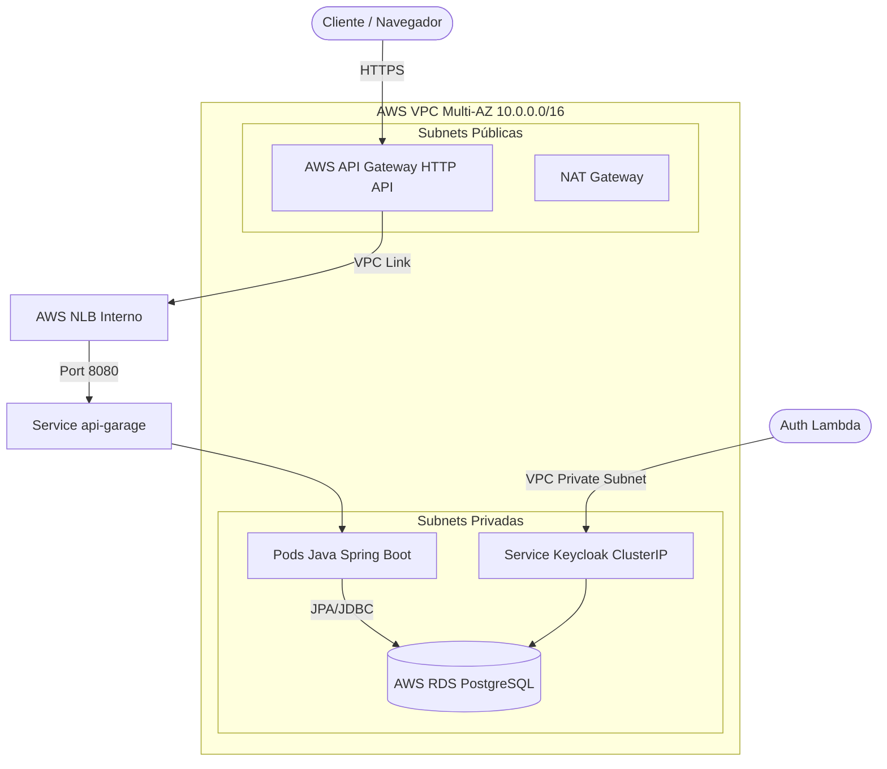

# 🚀 Passo 1: Infraestrutura Base, EKS & API Gateway (`15-soat-tech-challenge-iac-k8s`)

Este repositório é o **primeiro passo obrigatório** na esteira de provisionamento da infraestrutura do Tech Challenge na AWS. Ele é responsável por criar toda a fundação de rede, segurança, cluster Kubernetes gerenciado, repositório de contêineres e o ponto único de entrada via API Gateway.

---

## 🗺️ Visão Geral da Arquitetura



---

## 📋 Ordem Global de Execução dos Projetos

Para evitar erros de dependência e recursos ausentes na AWS, siga rigorosamente esta sequência:

1. **`15-soat-tech-challenge-iac-k8s` (Este Repositório)**: Cria VPC, Subnets, NAT GW, EKS, Keycloak e API Gateway.
2. **`15-soat-tech-challenge-iac-db`**: Descobre a VPC criada aqui, provisiona o RDS PostgreSQL e a stack de Observabilidade.
3. **`15-soat-tech-challenge-lamda`**: Conecta na VPC criada aqui e expõe a Function URL para cadastro, consulta e autenticação.

---

## 🎓 Passo a Passo: Preparação no AWS Learner Lab

O projeto foi 100% calibrado para operar dentro dos limites do **AWS Academy Learner Lab**.

### 1. Obter Credenciais da Sessão
Toda vez que você inicia o laboratório (*Start Lab*), novas credenciais temporárias são geradas:
1. No console do AWS Academy, clique em **Start Lab** e aguarde o círculo ficar **verde**.
2. Clique no botão **AWS Details** e selecione o link **AWS CLI** (*Show*).
3. Copie as credenciais fornecidas.

### 2. Configurar o Terminal Local
* **No Windows (PowerShell)**:
  ```powershell
  $env:AWS_ACCESS_KEY_ID="COPIE_SUA_KEY"
  $env:AWS_SECRET_ACCESS_KEY="COPIE_SUA_SECRET"
  $env:AWS_SESSION_TOKEN="COPIE_SEU_TOKEN"
  $env:AWS_DEFAULT_REGION="us-east-1"
  ```
* **No Linux / macOS (Bash)**:
  ```bash
  export AWS_ACCESS_KEY_ID="COPIE_SUA_KEY"
  export AWS_SECRET_ACCESS_KEY="COPIE_SUA_SECRET"
  export AWS_SESSION_TOKEN="COPIE_SEU_TOKEN"
  export AWS_DEFAULT_REGION="us-east-1"
  ```

### 3. Validar Conexão
```bash
aws sts get-caller-identity
```

---

## ⚙️ Execução do Terraform

Dentro da pasta do projeto `15-soat-tech-challenge-iac-k8s`:

```bash
# 1. Inicializar plugins e módulos
terraform init

# 2. Validar sintaxe dos arquivos
terraform validate

# 3. Planejar as alterações
terraform plan

# 4. Aplicar e provisionar na AWS
terraform apply -auto-approve
```

> [!NOTE]
> O provisionamento do cluster EKS gerenciado pela AWS leva em média de **10 a 14 minutos**.

---

## 🔌 Conexão e Validação do Kubernetes

Após a conclusão do `terraform apply`, atualize seu arquivo `~/.kube/config` para operar o cluster via `kubectl`:

```bash
aws eks update-kubeconfig --region us-east-1 --name techchallenge-cluster
```

### Verificar o Cluster:
```bash
# Verificar nós de trabalho (devem aparecer 2 nós t3.small Ready)
kubectl get nodes

# Verificar pods do sistema e das aplicações
kubectl get pods -A
```

### 💡 O que esperar dos Pods após o Passo 1:
* **`metrics-server`, `coredns`, `kube-proxy`, `aws-node`**: Devem estar com status `Running`.
* **`api-garage`**: Estará com status `ImagePullBackOff` pois a imagem Docker ainda não foi construída e publicada no ECR (feita pela pipeline de CI/CD da aplicação).
* **`keycloak`**: Ficará reiniciando temporariamente até o banco de dados PostgreSQL ser criado no **Passo 2**.

---

## 🛠️ Detalhes dos Módulos Provisionados

| Módulo | Recursos Criados |
| :--- | :--- |
| **`modules/eks-cluster`** | VPC `10.0.0.0/16`, 2 Subnets Públicas, 2 Subnets Privadas, Internet Gateway, NAT Gateway, EKS Cluster Kubernetes 1.29 e Node Group com 2 nós `t3.small` (utiliza a `LabRole` obrigatória). |
| **`modules/ecr`** | Repositório AWS ECR `garage-api` para armazenamento de imagens de contêiner com varredura de vulnerabilidades. |
| **`modules/keycloak`** | Deployment do Keycloak 24, Secret com credenciais administrativas e Service interno ClusterIP (`http://keycloak.garage.svc.cluster.local:8080`). |
| **`modules/app-garage`** | Deployment Spring Boot, ServiceAccount com IRSA, Service LoadBalancer (com anotações de **NLB Interno** da AWS) e HPA de 2 a 5 réplicas. |
| **`modules/api-gateway`** | AWS API Gateway HTTP API v2 com integração via VPC Link para o Listener do NLB interno descoberto dinamicamente. |

---

## ⚠️ Troubleshooting & Dicas do Learner Lab

1. **Erro `policy/voc-cancel-cred`**:
   * **Causa**: O timer da sessão no navegador atingiu o limite ou a aba do laboratório foi pausada.
   * **Solução**: Volte ao painel do AWS Academy, clique em **Start Lab** novamente e atualize suas credenciais locais no terminal.
2. **Erro `Too many pods`**:
   * Uma instância `t3.small` na AWS suporta até 11 pods. Por esse motivo, o Node Group está configurado com `desired_size = 2` (capacidade total de 22 pods).
3. **Preservação de Créditos ao final do dia**:
   * Ao finalizar o uso, desmonte os recursos na ordem inversa para não consumir seu orçamento de US$ 50/100:
     1. Destrua a Lambda (`15-soat-tech-challenge-lamda`)
     2. Destrua o Banco (`15-soat-tech-challenge-iac-db`)
     3. Destrua o EKS (`15-soat-tech-challenge-iac-k8s`) via `terraform destroy -auto-approve`
