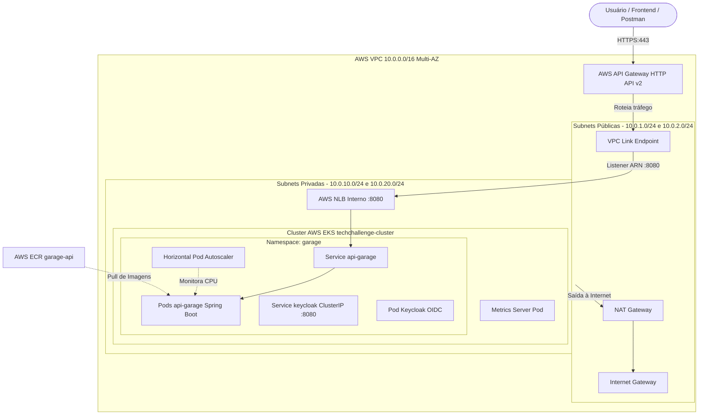

# 🚀 Infraestrutura EKS, Rede & API Gateway (`15-soat-tech-challenge-iac-k8s`)

Repositório central de **Infraestrutura como Código (IaC)** responsável por provisionar a rede VPC Multi-AZ, o cluster gerenciado **AWS EKS**, o servidor de identidade **Keycloak**, o repositório de contêineres **AWS ECR** e o ponto único de entrada público via **AWS API Gateway**.

---

## 🎯 1. Descrição do Propósito

Este repositório estabelece a fundação de nuvem e orquestração de contêineres para todo o ecossistema do Tech Challenge:
* **Isolamento e Segurança de Rede**: Criação de VPC com subnets públicas e privadas, NAT Gateway para saída controlada à internet e grupos de segurança restritivos.
* **Orquestração de Microsserviços**: Provisionamento do cluster gerenciado **AWS EKS** com autoscaling de nós e Horizontal Pod Autoscaler (HPA).
* **Ponto Único de Entrada (Single Entrypoint)**: Exposição segura das APIs internas através do **AWS API Gateway (HTTP API v2)** integrado via **VPC Link** ao **Network Load Balancer (NLB) interno** da AWS.
* **Gestão de Identidades no Cluster**: Execução do **Keycloak 24** dentro do Kubernetes em modo seguro para fornecer autenticação OIDC à Lambda e aos microsserviços.
* **Repositório de Imagens**: Criação do **AWS ECR** (`garage-api`) com criptografia e varredura de vulnerabilidades contínua.

---

## 💻 2. Tecnologias Utilizadas

* **Infraestrutura como Código**: Terraform 1.6+ (com HCL modularizado em `modules/`).
* **Cloud Provider**: Amazon Web Services (AWS) no ambiente **AWS Academy Learner Lab**.
* **Orquestração de Contêineres**: AWS Elastic Kubernetes Service (EKS v1.29) com Managed Node Groups (`t3.small`).
* **Rede & Tráfego AWS**: AWS VPC, Internet Gateway, Elastic IP, NAT Gateway, AWS Network Load Balancer (NLB) interno e AWS API Gateway HTTP v2 com VPC Link.
* **Gerenciamento de Pacotes K8s**: Helm 3 (Helm Release para o `metrics-server`).
* **Gestão de Identidade & Acesso**: Keycloak 24.0.5, OpenID Connect (OIDC), OAuth2 e AWS IAM Role (`LabRole`).
* **Registro de Imagens**: Amazon Elastic Container Registry (ECR).
* **Automação de CI/CD**: GitHub Actions com runners `ubuntu-latest`.

---

## 🏛️ 3. Diagrama da Arquitetura do Repositório



---

## ⚙️ 4. Passos para Execução e Deploy

### 4.1. Configurar Credenciais da AWS
No painel do AWS Academy Learner Lab:
1. Inicie o lab clicando em **Start Lab** (aguarde o status ficar verde).
2. Clique em **AWS Details** ➔ **AWS CLI** (*Show*) e copie os valores.
3. Exporte no seu terminal:

* **Windows (PowerShell)**:
  ```powershell
  $env:AWS_ACCESS_KEY_ID="COPIE_SUA_KEY"
  $env:AWS_SECRET_ACCESS_KEY="COPIE_SUA_SECRET"
  $env:AWS_SESSION_TOKEN="COPIE_SEU_TOKEN"
  $env:AWS_DEFAULT_REGION="us-east-1"
  ```
* **Linux / macOS (Bash)**:
  ```bash
  export AWS_ACCESS_KEY_ID="COPIE_SUA_KEY"
  export AWS_SECRET_ACCESS_KEY="COPIE_SUA_SECRET"
  export AWS_SESSION_TOKEN="COPIE_SEU_TOKEN"
  export AWS_DEFAULT_REGION="us-east-1"
  ```

### 4.2. Provisionar com o Terraform
Dentro da pasta `15-soat-tech-challenge-iac-k8s`:

```bash
# 1. Inicializar providers e módulos
terraform init

# 2. Validar sintaxe
terraform validate

# 3. Planejar as alterações
terraform plan

# 4. Aplicar o provisionamento (cerca de 10 a 14 minutos)
terraform apply -auto-approve
```

### 4.3. Conectar ao Cluster via Kubeconfig
```bash
aws eks update-kubeconfig --region us-east-1 --name techchallenge-cluster
```

Verifique se os nós e pods estão saudáveis:
```bash
kubectl get nodes
kubectl get pods -A
```

---

## 📑 5. Link para o Swagger e Postman das APIs

Como este repositório provisiona o **AWS API Gateway**, ele é a porta de entrada oficial da aplicação na nuvem:

### 🌐 Endpoints do Swagger / OpenAPI na Nuvem:
* **Swagger UI Oficial**: 
  ```
  https://igqc9vtfx9.execute-api.us-east-1.amazonaws.com/api/swagger-ui/index.html
  ```
* **OpenAPI 3 JSON Spec**: 
  ```
  https://igqc9vtfx9.execute-api.us-east-1.amazonaws.com/api/v3/api-docs
  ```

### 📬 Testes Rápidos via Postman / cURL:

```bash
# 1. Testar conexão através do API Gateway
curl -i --location 'https://igqc9vtfx9.execute-api.us-east-1.amazonaws.com/api/actuator/health'

# 2. Keycloak Endpoint Interno (via Pod no cluster):
# URL: http://keycloak.garage.svc.cluster.local:8080/realms/garage/.well-known/openid-configuration
```
